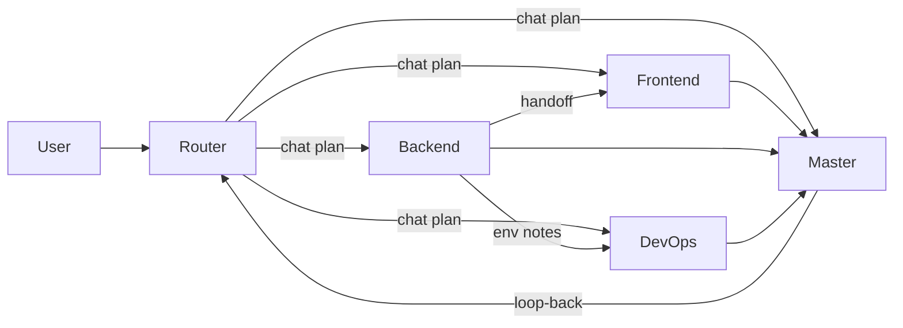

# Architecture

## Problem

Cursor runs **one agent per chat**. Large monorepos need:

1. A clear answer to “who should do this?”
2. Memory that survives when the chat ends
3. Ownership so Backend and Frontend don’t edit each other’s trees by accident

## Solution

A **human-scheduled virtual team** living in `.cursor/`:



| Agent | Role |
|-------|------|
| **Router** | Outside the team. Outputs numbered chat plans with copy-paste prompts. Never implements. |
| **Master** | Tech lead. Prioritize, approve handoffs, review, close loops, compact STATE weekly. |
| **Backend** | Owns `{{BACKEND_DIR}}/` — API, DB, contracts. |
| **Frontend** | Owns `{{FRONTEND_DIR}}/` — UI / client. |
| **DevOps** | Deploy, CI, secrets — not feature code. |

Custom agents (`npx cursor-agent-kit add-agent …`) plug into the same STATE + handoff protocol.

## File layout

```
.cursor/
├── rules/                 # .mdc coding rules (token-budgeted)
├── skills/<id>-agent/     # @-invokable personas
└── agents/
    ├── agents.json        # manifest
    ├── STATE_PROTOCOL.md
    ├── WORKFLOW.md
    ├── HANDOFF-TEMPLATE.md
    └── <id>/{ROLE.md,STATE.md}
```

## STATE brain

Each agent’s `STATE.md` is institutional memory:

- **Hot:** Brain snapshot, focus, active handoff, blockers (overwrite)
- **Cold:** Facts, decision log (`D-XX-NNN`), open loops, session/handoff history (append)

See [docs/state-protocol.md](docs/state-protocol.md).

## Handoffs

Specialists pass structured briefs (`HANDOFF-TEMPLATE.md`) including API contracts and related decision IDs. Master tracks open loops until closed.

## What this is not

- Not a runtime multi-agent swarm
- Not a replacement for `.cursor/rules` (complementary)
- Not automatic CI — you still open chats and paste prompts
