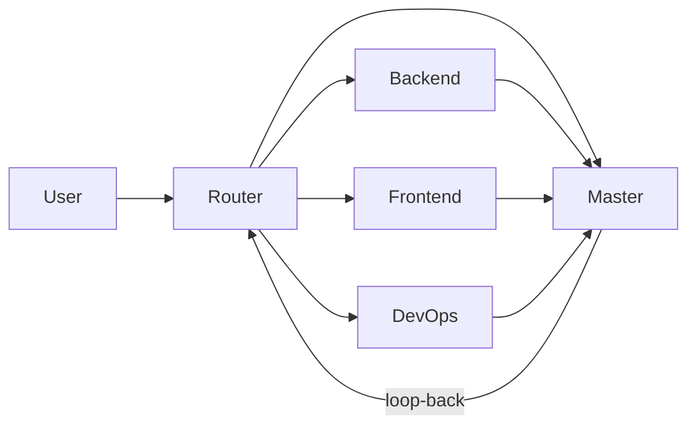

<p align="center">
  
</p>

# cursor-agent-kit

[](https://www.npmjs.com/package/cursor-agent-kit)
[](https://bundlephobia.com/package/cursor-agent-kit)
[](./LICENSE)

Open-source **multi-agent orchestration for [Cursor](https://cursor.com) IDE** — a Router that tells you which chat to open, specialist agents with ownership boundaries, and a STATE protocol for institutional memory (decision IDs, handoffs, weekly compaction).

## Install

This is a CLI, not a library. Run it in your project root:

```bash
npx cursor-agent-kit init
```

Or install globally:

```bash
npm install -g cursor-agent-kit
cursor-agent-kit init
```

Requires Node.js 18+. MIT licensed.

## Problem

Single Cursor chats lose context. Monorepos need clear ownership (“don’t edit the API from a UI chat”) and a way to remember *why* you chose something last week.

## Solution



| Piece | What it does |
|-------|----------------|
| **Router** | Outputs a numbered chat plan (whom to `@`, Plan vs Agent mode, copy-paste prompts) |
| **Specialists** | Master · Backend · Frontend · DevOps (configurable — add your own) |
| **STATE protocol** | Per-agent memory with decision IDs (`D-BE-003`) so agents cite instead of re-ask |
| **Handoffs** | Structured Backend → Frontend contracts and loop-backs |

See [ARCHITECTURE.md](./ARCHITECTURE.md) for the full design.

## Quick start

```bash
# inside your project root (monorepo root recommended)
npx cursor-agent-kit init

# or non-interactive
npx cursor-agent-kit init --yes \
  --var PROJECT_NAME="Acme" \
  --var BACKEND_DIR=api \
  --var FRONTEND_DIR=web
```

Then in Cursor:

1. Open the project root as the workspace
2. Edit `.cursor/rules/project-overview.mdc`
3. Chat: `@router-agent` + your task in plain language
4. Open new chats from the Router’s prompts

### Manage agents

```bash
npx cursor-agent-kit list-agents
npx cursor-agent-kit add-agent product --name "Product" --owns "docs/**"
npx cursor-agent-kit remove-agent product
```

## Why STATE beats “just remember”

| Store in STATE | Store elsewhere |
|----------------|-----------------|
| Ports, env patterns, implementation choices | Product scoring / pricing → product spec |
| Decision rationale + IDs | Design tokens → design docs |
| Open loops & handoff history | Repeated mistakes → `docs/AGENT_PITFALLS.md` |

Hot sections overwrite each session; cold sections append. Master compacts weekly. Details: [docs/state-protocol.md](./docs/state-protocol.md).

## Docs

| Doc | Topic |
|-----|--------|
| [docs/getting-started.md](./docs/getting-started.md) | Install + daily loop |
| [docs/state-protocol.md](./docs/state-protocol.md) | Decision IDs, hot/cold memory |
| [docs/rules-best-practices.md](./docs/rules-best-practices.md) | `.mdc` activation modes + token budget |
| [docs/comparison.md](./docs/comparison.md) | vs plain rules / Memory Bank |
| [docs/publishing.md](./docs/publishing.md) | npm publish (maintainers) |
| [examples/minimal-webapp](./examples/minimal-webapp) | Worked example with sample decisions |

## Example

[`examples/minimal-webapp`](./examples/minimal-webapp) is a fictional TaskBoard monorepo with populated STATE files, a completed handoff, and a sample Router chat plan — browse without running anything.

## Requirements

- Node.js **≥ 18**
- [Cursor](https://cursor.com) IDE

Zero runtime dependencies.

## Resume / portfolio angle

This kit packages a battle-tested pattern: **human-scheduled specialist agents** with **persistent decision logs**, not just a pile of prompts. Useful framing:

> Designed a multi-agent orchestration framework for Cursor — Router for task routing, role-specialized agents with ownership boundaries, and a STATE protocol for institutional memory across sessions.

## License

[MIT](./LICENSE)
